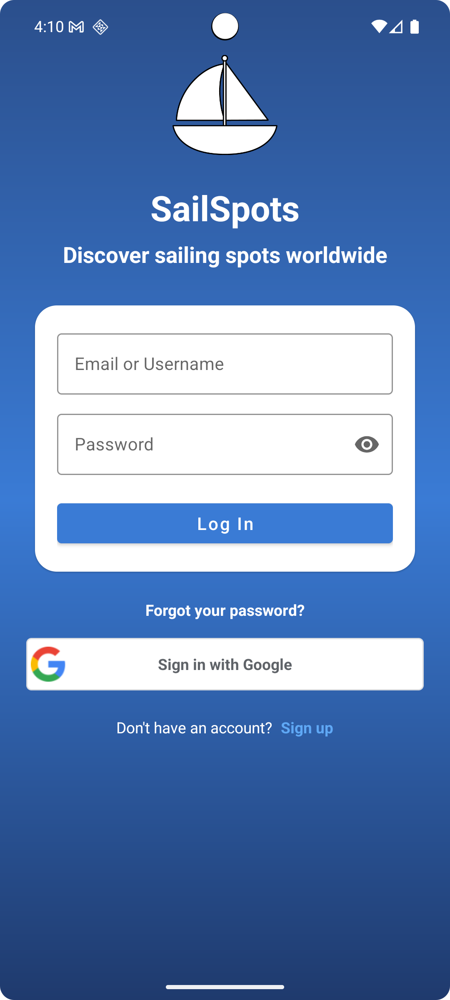
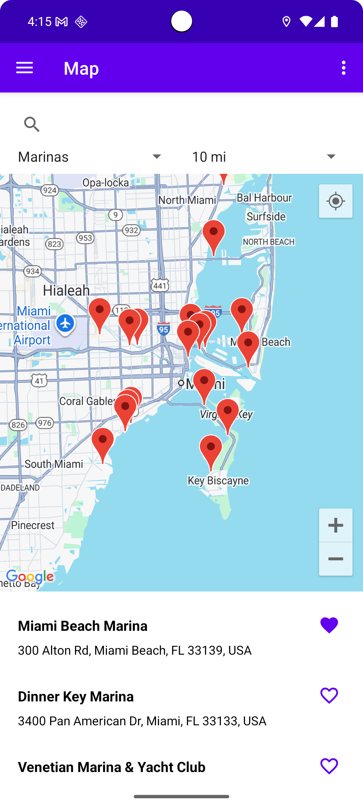
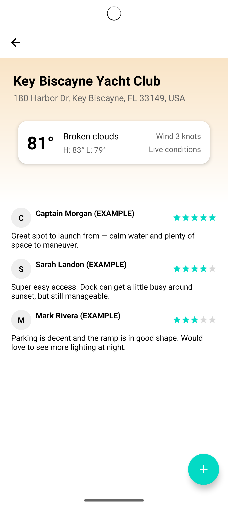
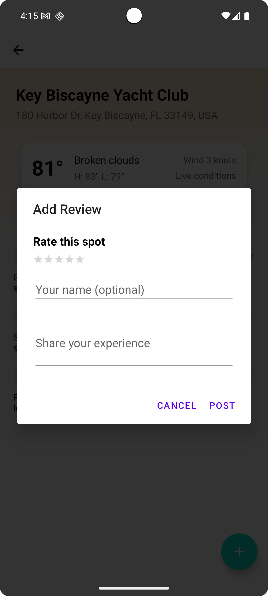

# SailSpots

**Course:** SWENG 888 Mobile Comp & Apps
**Professor:** Everton Guimaraes, Ph.D
**Author:** Race Mahoney & Brandon Bagby

## Table of Contents
1. [Project Overview](#project-overview)
2. [Core Features](#core-features)
3. [Technical Stack & Architecture](#technical-stack--architecture)
4. [Screenshots](#screenshots)
5. [Setup & Installation](#setup--installation)
6. [API Key Configuration](#api-key-configuration)
7. [Build and Dependency Information](#7-build-and-dependency-information)

---

## 1. Project Overview

SailSpots is an Android application designed to help sailors and boaters discover, view, and review local marinas and points of interest ("spots"). The app provides a user-friendly interface to browse a list of locations, view them on a map, and see detailed information, including live weather conditions and community-sourced reviews.

This project demonstrates proficiency in fundamental Android development concepts, including:
-   Modern UI/UX design with Material 3 components.
-   Client-side and server-side data management with Google Firestore.
-   Integration with third-party REST APIs for location and weather data.
-   Asynchronous programming for network and database operations.
-   Secure handling of API keys using Gradle's `BuildConfig`.

## 2. Core Features

### Feature 1: Marina List & Search
-   Displays a list of marinas fetched sourced from the Google Maps API.
-   Users can search for a specific marina by name or location.
-   The UI is built with `RecyclerView` for efficient and scalable list rendering.
-   Users can mark certain spots as their favorites to come back to for easier viewing.

### Feature 2: Marina Detail View
-   Tapping a marina opens a detailed view showing its name, address, and user-submitted reviews.
-   **Live Weather Integration:** Fetches and displays real-time weather conditions for the marina's location using the OpenWeatherMap API. This includes temperature, wind speed (knots), and a general condition summary.
-   **Dynamic UI:** The background of the weather panel dynamically changes its color gradient based on the current temperature, providing an intuitive visual cue (from cool blues to warm oranges).

### Feature 3: Community Reviews & Ratings
-   Users can read reviews submitted by others, including a star rating and a written comment.
-   A **Floating Action Button (FAB)** allows users to add their own review.
-   Reviews are stored and retrieved in real-time from a **Google Firestore** database. New reviews appear instantly for all users without needing a manual refresh.

### Feature 4: Interactive Map View with Search & Filtering
-   **Google Maps Integration:** Leverages the native Google Maps SDK for a familiar and fluid user experience, including smooth panning, zooming, and location tracking.
-   **Dynamic Search:** Users can search for any city, region, or point of interest using an integrated search bar. The map automatically moves to the specified location.
-   **Proximity-Based Filtering:** The app allows users to filter the displayed spots based on their distance from the current map center, with predefined options (e.g., within 10 miles, 25 miles, etc.).
-   **Type-Based Filtering:** Users can further refine their search by filtering for specific types of spots (e.g., "marina," "boat ramp," etc.), making it easy to find exactly what they need.
-   **Interactive Markers:** Each discovered spot is represented by a pin on the map. Tapping a pin reveals an info window with the spot's name and address, providing a direct link to the detailed view.

---

## 3. Technical Stack & Architecture

This project is built using a combination of modern Android libraries and Google Cloud services.

-   **Language:** **Java**
-   **UI Toolkit:**
    -   **Material 3 Components:** Utilized for modern UI elements like `MaterialToolbar`, `BottomNavigationView`, and `FloatingActionButton`.
    -   **RecyclerView:** For displaying efficient, scrollable lists of marinas and comments.
    -   **ConstraintLayout:** For creating complex, responsive layouts.
-   **Architecture:**
    -   **Single-Activity Architecture:** Uses a single `MainActivity` to host multiple `Fragment`s, which is a modern and recommended Android pattern.
    -   **Fragment-based Navigation:** `BottomNavigationView` is used to switch between the main sections of the app (List, Map, Settings).
-   **Data Persistence & Networking:**
    -   **Google Firestore:** A NoSQL, cloud-hosted database used for storing and syncing user-generated reviews in real-time. This demonstrates server-side data management.
    -   **HttpURLConnection:** The `WeatherClient.java` class handles making `GET` requests to the OpenWeatherMap REST API on a background thread using `ExecutorService` and `HttpURLConnection`.
-   **Security:**
    -   **BuildConfig for API Keys:** Sensitive API keys (like the OpenWeatherMap key) are stored securely in `local.properties` and accessed via the auto-generated `BuildConfig` file, ensuring they are not exposed in version control.
---

## 4. Screenshots

 Login Screen | Marina List + Map | Marina Detail (with Weather) | Add Review Dialog |
| :---: | :---: | :---: | :---: |
|  |  |  |  |

---

## 5. Setup & Installation

1.  Clone the repository to your local machine:
`git clone https://github.com/your-username/SailSpots.git`
2.  Open the project in Android Studio.
3.  Configure your API key by following the instructions in the next section.
4.  Let Gradle sync and download the required dependencies.
5.  Run the app on an emulator or a physical Android device.
    
## 6. API Key Configuration

To fetch live weather data, you must provide your own OpenWeatherMap API key.

1.  **Get an API Key:**
    -   Sign up for a free account at [OpenWeatherMap.org](https://openweathermap.org/).
    -   Navigate to the "API keys" section and copy your default key.

2.  **Add the Key to Your Project:**
    -   In the root directory of the Android Studio project, find or create a file named `local.properties`.
    -   Add the following line to the `local.properties` file, replacing
    `properties OPENWEATHER_API_KEY="YOUR_API_KEY"`
    -   The `local.properties` file is included in `.gitignore` by default, so your key will not be committed to version control.

3.  **Sync Gradle:**
    -   Android Studio will prompt you to sync your project. Click "Sync Now". The project is already configured to read this key from `local.properties` and make it available in the app through `BuildConfig.OPENWEATHER_API_KEY`.

---

## 7. Build and Dependency Information

This project was built using the following key configurations and libraries:

-   **Android Studio Version:** [e.g., Hedgehog | 2023.1.1]
-   **Target SDK:** 34
-   **Min SDK:** 24
-   **Core Dependencies:**
    -   `com.google.android.material:material:1.13.0` (For Material Design Components)
    -   `com.google.firebase:firebase-firestore` (For Real-time Reviews Database)
    -   `com.google.android.gms:play-services-maps:19.2.0` (For Google Maps Functionality)
    -   `androidx.navigation:*:2.9.4` (For Single-Activity Fragment Navigation)